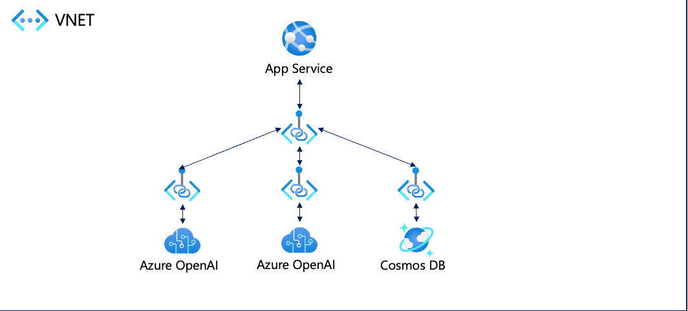

# 概要

App ServiceとAzure OpenAIとCosmosDBを使ってプライベートエンドポイント経由で通信するためのサンプルです。

## 構成



## Tasks

- [x]App ServiceとCosmosDBのインフラと共に、サンプルアプリをデプロイする
- [x]Azure OpenAIのデプロイ
- [x]App ServiceとAzure OpenAIの通信をプライベートエンドポイント経由で行う
- [x]App ServiceとCosmosDBの通信をプライベートエンドポイント経由で行う

## 使い方

azdを使用

### ログイン

```bash
azd auth login
```

### リソース作成&デプロイ

```bash
azd provision
```

### リソース削除

```bash
azd down
```

### プライベートエンドポイントを利用する場合

```bash
azd env set AZURE_USE_PRIVATE_ENDPOINTS true
```

さらに、Azure OpenAIとCosmosDBのパブリックアクセスを無効する場合

```bash
azd env set AZURE_PUBLIC_NETWORK_ACCESS Disabled
```

もしくは`.azure/{環境名}/.env`に以下のように記述します。

```bash
AZURE_USE_PRIVATE_ENDPOINT="true"
AZURE_PUBLIC_NETWORK_ACCESS="Disabled"
```

その上で`azd provision`を実行します。

## 参考

[app-service-regional-vnet-integration](https://github.com/Azure/azure-quickstart-templates/tree/master/quickstarts/microsoft.web/app-service-regional-vnet-integration)

[cosmosdb-webapp](https://github.com/Azure/azure-quickstart-templates/tree/master/quickstarts/microsoft.documentdb/cosmosdb-webapp)

[azd-starter-bicep](https://github.com/Azure-Samples/azd-starter-bicep/tree/main/infra/core)

[RAG chat app with Azure OpenAI and Azure AI Search (Python)](https://github.com/Azure-Samples/azure-search-openai-demo)